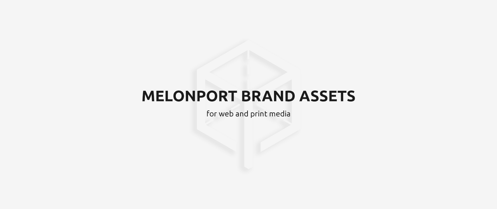
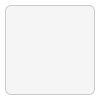

# Branding
Blockchain software for asset management

# Contact
### NOTE: DO NOT USE MELONPORT LOGO WITHOUT OUR CONSENT.
For commerical usage please contact team@melonport.com  
For additonal media inquiries please contact team@melonport.com  
For non-commercial usage please notify us at http://chat.melonport.com/

# Melonport Logos For Web
* Melonport White Logo [Download](https://github.com/melonproject/branding/blob/master/logo-for-web/01_melonport_white_logo.png)
* Melonport Dark Logo [Download](https://github.com/melonproject/branding/blob/master/logo-for-web/02_melonport_blue_logo.png)
* Melonport Vertical White Logo [Download](https://github.com/melonproject/branding/blob/master/logo-for-web/03_melonport_vertical_white_logo.png)
* Melonport Vertical Dark Logo [Download](https://github.com/melonproject/branding/blob/master/logo-for-web/04_melonport_vertical_blue_logo.png)
* Melonport White Logo Icon [Download](https://github.com/melonproject/branding/blob/master/logo-for-web/05_melonport_white_logo_icon.png)
* Melonport Dark Logo Icon [Download](https://github.com/melonproject/branding/blob/master/logo-for-web/06_melonport_blue_logo_icon.png)

# Melonport Logos For Print
* Melonport-logo-white.eps [Download](https://github.com/melonproject/branding/blob/master/logo-for-print/01_Melonport_logo_blue.eps)
* Melonport-logo-blue.eps [Download](https://github.com/melonproject/branding/blob/master/logo-for-print/02_Melonport_logo_white.eps)
* Melonport-logo-black.eps [Download](https://github.com/melonproject/branding/blob/master/logo-for-print/03_Melonport_logo_black.eps)
* Melonport-logo-icon.eps [Download](https://github.com/melonproject/branding/blob/master/logo-for-print/04_Melonport_logo_icon.eps)

# Melonport Brand Colors
*  Smoked White (primary) #F5F5F5
*  Melon Black (primary) #1B1B1B
*  Melon Blue (primary) #1189C6
*  Melon Black (secondary) #171717
*  Melon White (secondary) #FFFFFF

# Melon Colors
*  Primary Colors #FFFDF3
*  Black #000000

# Download All Media Kit
Download all Melon Media Kit [here](https://github.com/melonproject/branding/blob/master/all-media-assets/all-media-assets.zip)
